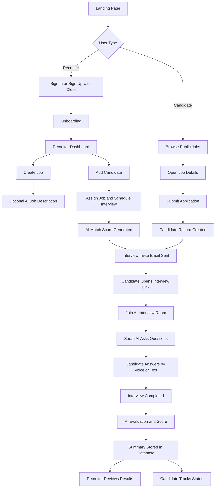
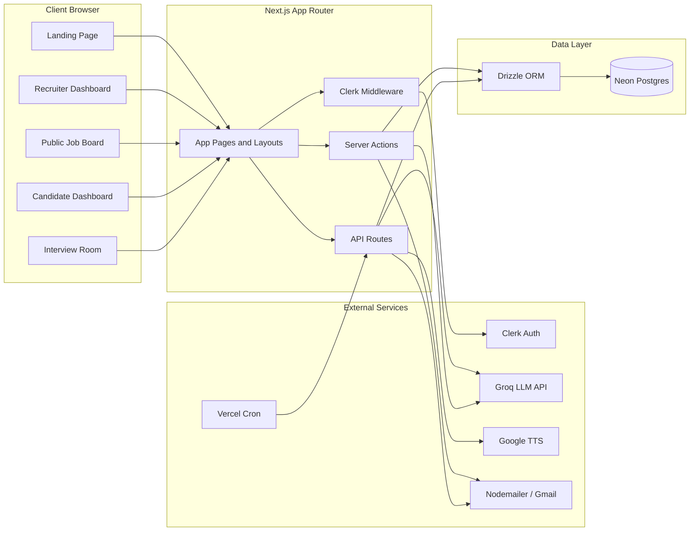

# Recrutva

Recrutva is an AI-powered hiring platform built with Next.js. It helps recruiters create job posts, import or receive candidate applications, schedule AI voice interviews, and review AI-generated screening summaries. Candidates can browse public jobs, apply to roles, join an AI interview room, and track their application status from a candidate dashboard.

## Table of Contents

- [Overview](#overview)
- [Features](#features)
- [Tech Stack](#tech-stack)
- [Project Structure](#project-structure)
- [Environment Variables](#environment-variables)
- [Getting Started](#getting-started)
- [How It Works](#how-it-works)
- [User Workflow Diagram](#user-workflow-diagram)
- [System Architecture Diagram](#system-architecture-diagram)
- [Data Model](#data-model)
- [Important Routes](#important-routes)
- [Available Scripts](#available-scripts)
- [Deployment](#deployment)

## Overview

Recrutva is designed around two main user groups:

- Recruiters manage job openings, candidate pipelines, interview schedules, and screening outcomes.
- Candidates browse active roles, submit applications, complete AI interviews, and review their application progress.

The platform uses AI in several places:

- Job description generation.
- Resume-to-job match scoring.
- Personalized interview question generation.
- Interview transcript evaluation and scoring.
- Voice-based interview playback through text-to-speech.

## Features

### Recruiter Features

- Secure authentication using Clerk.
- Recruiter dashboard with candidate pipeline metrics.
- Job management for creating, listing, searching, and deleting job openings.
- AI-assisted job description generation.
- Candidate import with name, email, phone, resume upload placeholder, linked job, and schedule date.
- Candidate search, role filtering, status filtering, and candidate editing.
- Interview schedule management with rescheduling and interview link copying.
- Completed interview summary view with per-question scoring and AI feedback.
- Daily reminder cron endpoint for scheduled interviews.

### Candidate Features

- Public job board at `/jobs`.
- Public job detail and application page at `/jobs/[id]`.
- Duplicate application check for signed-in candidates.
- Candidate dashboard for tracking applications and interview status.
- AI interview room at `/interview/[id]`.
- Browser camera and microphone access for interview sessions.
- Speech-to-text support through browser speech recognition.
- Manual answer input fallback during interviews.
- AI-generated interview result page after completion.

### AI and Automation Features

- Groq-powered job description generation.
- Groq-powered candidate-job match scoring.
- Groq-powered interview question generation.
- Groq-powered interview evaluation and executive summary generation.
- Google TTS powered AI interviewer voice.
- Nodemailer-based interview invitation and reminder emails.
- Vercel cron configuration for recurring reminders.

## Tech Stack

| Layer | Technology |
| --- | --- |
| Framework | Next.js 16 App Router |
| UI | React 19, Tailwind CSS 4, shadcn-style UI components, lucide-react |
| Auth | Clerk |
| Database | Neon Postgres |
| ORM | Drizzle ORM |
| AI | Groq SDK |
| Voice | google-tts-api, browser speech recognition |
| Email | Nodemailer |
| Charts | Recharts |
| Animation | Framer Motion |
| Validation | Zod, React Hook Form |
| Deployment | Vercel |

## Project Structure

```text
recrutva/
|-- app/
|   |-- (dashboard)/dashboard/       # Recruiter dashboard, jobs, candidates, schedules
|   |-- (candidate)/candidate-dashboard/
|   |-- actions/                     # Server actions for jobs, candidates, matching
|   |-- api/                         # API routes for AI, interview, TTS, cron
|   |-- interview/[id]/              # AI interview room and result view
|   |-- jobs/                        # Public job board and job application pages
|   |-- onboarding/                  # Role selection after signup
|   |-- layout.tsx
|   `-- page.tsx                     # Landing page
|-- components/                      # App components and UI primitives
|-- db/
|   |-- index.ts                     # Neon + Drizzle database client
|   `-- schema.ts                    # Drizzle table definitions
|-- lib/
|   |-- interview-email.ts           # Invitation email builder and sender
|   |-- prisma.ts
|   `-- utils.ts
|-- prisma/                          # Prisma config/schema placeholder
|-- public/                          # Static assets
|-- scratch/                         # Local migration and verification scripts
|-- drizzle.config.ts
|-- middleware.ts                    # Clerk middleware
|-- vercel.json                      # Cron configuration
`-- package.json
```

## Environment Variables

Create a `.env` file in the project root and configure the values required by your environment.

```env
DATABASE_URL="postgresql://..."

NEXT_PUBLIC_CLERK_PUBLISHABLE_KEY="..."
CLERK_SECRET_KEY="..."

GROQ_API_KEY="..."

EMAIL_USER="your-gmail-address@gmail.com"
EMAIL_PASS="your-gmail-app-password"

NEXT_PUBLIC_APP_URL="http://localhost:3000"
```

Notes:

- `DATABASE_URL` is used by the Neon/Drizzle database client.
- `GROQ_API_KEY` is required for AI job generation, matching, questions, and evaluation.
- `EMAIL_USER` and `EMAIL_PASS` are used by Nodemailer for interview invitations and reminders.
- `NEXT_PUBLIC_APP_URL` is used to generate interview and job links inside emails.
- Clerk keys are required for authentication and user sessions.

## Getting Started

Install dependencies:

```bash
npm install
```

Push the Drizzle schema to the database:

```bash
npm run db:push
```

Start the development server:

```bash
npm run dev
```

Open the app:

```text
http://localhost:3000
```

## How It Works

### Recruiter Flow

1. A recruiter signs in with Clerk.
2. The recruiter enters the onboarding flow and chooses the hiring manager path.
3. The recruiter creates a job manually or generates the description with AI.
4. The recruiter adds candidates and assigns them to a job with a scheduled interview date.
5. Recrutva calculates a match score between the candidate resume text and the target job.
6. The platform sends the candidate an interview invitation email.
7. The recruiter monitors candidates, schedules, status changes, and completed results.
8. After the AI interview is completed, the recruiter reviews the transcript summary and score breakdown.

### Candidate Flow

1. A candidate visits the public job board.
2. The candidate opens a job details page and submits an application.
3. Recrutva creates a candidate record linked to the job and recruiter.
4. The candidate receives an interview link by email.
5. The candidate joins the AI interview room.
6. Sarah AI asks role-specific interview questions.
7. The candidate answers through speech recognition or manual text input.
8. Recrutva evaluates the transcript and stores the final score, summary, and detailed breakdown.
9. The candidate can view application status from the candidate dashboard.

## User Workflow Diagram



## System Architecture Diagram



## Data Model

The database schema is defined in `db/schema.ts`.

### `users`

Stores authenticated user metadata.

| Column | Purpose |
| --- | --- |
| `id` | Internal numeric ID |
| `clerkId` | Clerk user ID |
| `name` | User name |
| `email` | User email |
| `createdAt` | Creation timestamp |

### `jobs`

Stores recruiter-created job openings.

| Column | Purpose |
| --- | --- |
| `id` | Job ID |
| `userId` | Recruiter Clerk user ID |
| `title` | Job title |
| `description` | Job description |
| `requirements` | Role requirements |
| `location` | Job location |
| `status` | Job status, usually `Open` |
| `createdAt` | Creation timestamp |

### `applicants`

Stores candidates, applications, interview status, scores, transcripts, and AI analysis.

| Column | Purpose |
| --- | --- |
| `id` | Candidate/application ID |
| `userId` | Recruiter Clerk user ID |
| `targetJobId` | Linked job ID |
| `jobTitle` | Display role title |
| `name` | Candidate name |
| `email` | Candidate email |
| `phone` | Candidate phone |
| `resumeText` | Extracted or simulated resume content |
| `status` | Ready, Scheduled, Calling, Completed, Missed |
| `score` | AI interview score |
| `matchScore` | AI job fit score |
| `transcript` | Full interview transcript |
| `summary` | Recruiter-facing summary |
| `analysis` | Full JSON scoring breakdown |
| `scheduledAt` | Scheduled interview date/time |
| `lastNotifiedAt` | Last reminder timestamp |
| `createdAt` | Creation timestamp |

## Important Routes

| Route | Description |
| --- | --- |
| `/` | Marketing landing page |
| `/onboarding` | Role selection page |
| `/dashboard` | Recruiter command center |
| `/dashboard/jobs` | Recruiter job management |
| `/dashboard/candidates` | Candidate pipeline management |
| `/dashboard/schedules` | Interview schedule management |
| `/jobs` | Public job board |
| `/jobs/[id]` | Public job detail and application form |
| `/candidate-dashboard` | Candidate application tracking |
| `/interview/[id]` | AI interview room and summary view |
| `/api/ai/generate-job` | AI job description generation |
| `/api/interview/questions` | AI interview question generation |
| `/api/interview/complete` | Interview transcript evaluation |
| `/api/tts/stream` | AI voice audio stream |
| `/api/cron/reminders` | Scheduled interview reminder emails |
| `/api/candidate/[id]` | Candidate lookup for interview pages |

## Available Scripts

```bash
npm run dev
```

Starts the local Next.js development server.

```bash
npm run build
```

Builds the production app.

```bash
npm run start
```

Starts the production server after a build.

```bash
npm run lint
```

Runs ESLint.

```bash
npm run db:push
```

Pushes the Drizzle schema to the configured database.

```bash
npm run db:studio
```

Opens Drizzle Studio for database inspection.

## Deployment

The project is configured for Vercel deployment.

`vercel.json` registers a cron job:

```json
{
  "crons": [
    {
      "path": "/api/cron/reminders",
      "schedule": "46 10 * * *"
    }
  ]
}
```

Before deploying, configure all required environment variables in Vercel:

- `DATABASE_URL`
- `NEXT_PUBLIC_CLERK_PUBLISHABLE_KEY`
- `CLERK_SECRET_KEY`
- `GROQ_API_KEY`
- `EMAIL_USER`
- `EMAIL_PASS`
- `NEXT_PUBLIC_APP_URL`

## Current Limitations

- Resume parsing is currently simulated in the UI by storing placeholder resume text from the uploaded file name.
- Email sending uses Gmail through Nodemailer and requires an app password.
- Browser speech recognition support depends on the candidate's browser.
- Some dashboard metrics are static or illustrative and can be replaced with computed production values.
