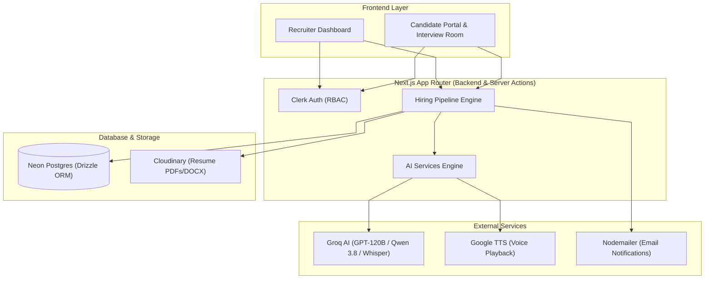
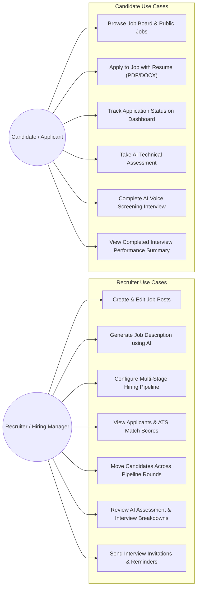

# Recrutva

An AI-powered recruitment and candidate evaluation platform that streamlines end-to-end hiring workflows: automated job description generation, multi-stage pipeline configuration, ATS resume screening (Groq AI & SkillSync NLP), automated online technical assessments, AI voice interviews with Google TTS & Speech-to-Text, and candidate management.

---

## 📐 System Architecture Diagram


```mermaid
%%{init: {'flowchart': {'curve': 'linear'}}}%%
graph TD
    subgraph Frontend ["Frontend Layer"]
        Recruiter["Recruiter Dashboard"]
        Candidate["Candidate Portal & Interview Room"]
    end

    subgraph Backend ["Next.js App Router (Backend & Server Actions)"]
        Auth["Clerk Auth (RBAC)"]
        Pipeline["Hiring Pipeline Engine"]
        AIEngine["AI Services Engine"]
    end

    subgraph StorageLayer ["Database & Storage"]
        DB[("Neon Postgres (Drizzle ORM)")]
        Storage["Cloudinary (Resume PDFs/DOCX)"]
    end

    subgraph ExternalServices ["External Services"]
        Groq["Groq AI (GPT-120B / Qwen 3.8 / Whisper)"]
        TTS["Google TTS (Voice Playback)"]
        Email["Nodemailer (Email Notifications)"]
    end

    Recruiter --> Auth
    Candidate --> Auth
    Recruiter --> Pipeline
    Candidate --> Pipeline
    Pipeline --> AIEngine
    Pipeline --> DB
    Pipeline --> Storage
    Pipeline --> Email
    AIEngine --> Groq
    AIEngine --> TTS
```

---

## 🎯 Use Case Diagram


```mermaid
graph LR
    subgraph Recruiter Use Cases
        UC1["Create & Edit Job Posts"]
        UC2["Generate Job Description using AI"]
        UC3["Configure Multi-Stage Hiring Pipeline"]
        UC4["View Applicants & ATS Match Scores"]
        UC5["Move Candidates Across Pipeline Rounds"]
        UC6["Review AI Assessment & Interview Breakdowns"]
        UC7["Send Interview Invitations & Reminders"]
    end

    subgraph Candidate Use Cases
        UC8["Browse Job Board & Public Jobs"]
        UC9["Apply to Job with Resume (PDF/DOCX)"]
        UC10["Track Application Status on Dashboard"]
        UC11["Take AI Technical Assessment"]
        UC12["Complete AI Voice Screening Interview"]
        UC13["View Completed Interview Performance Summary"]
    end

    Recruiter((Recruiter / Hiring Manager)) --> UC1
    Recruiter --> UC2
    Recruiter --> UC3
    Recruiter --> UC4
    Recruiter --> UC5
    Recruiter --> UC6
    Recruiter --> UC7

    Candidate((Candidate / Applicant)) --> UC8
    Candidate --> UC9
    Candidate --> UC10
    Candidate --> UC11
    Candidate --> UC12
    Candidate --> UC13
```

---

## 🌟 Overview

Recrutva bridges recruiters and job seekers using cutting-edge AI:

- **Recruiters** create and manage job postings, customize multi-round hiring pipelines (Resume Screening, Skill Assessments, AI Voice Interviews, Manual Review), track candidates stage-by-stage with strict recruiter data isolation, and view AI-generated candidate summaries.
- **Candidates** search public job listings, submit resumes with automatic text parsing, complete online technical assessments and AI voice interviews, and monitor application status through a dedicated candidate dashboard.

---

## ✨ Key Features

### 👔 Recruiter Portal
- **Clerk Authentication & Role-Based Access Control**: Strict isolation ensures recruiters only access their own jobs and candidate data.
- **AI-Assisted Job Creation**: Generate rich, structured job descriptions (responsibilities, required/preferred skills, qualifications, salary ranges, benefits) powered by Groq AI.
- **Configurable Hiring Pipelines**: Set up custom multi-stage pipelines per job with ordered rounds (`RESUME_SCREENING`, `ASSESSMENT`, `AI_INTERVIEW`, `MANUAL_REVIEW`).
- **ATS & SkillSync Resume Matcher**: Automated resume-to-job match scoring (0–100%) using Groq AI and NLP keyphrase parsing.
- **Candidate Pipeline Dashboard**: Drag-and-drop or status-driven stage advancement, filtering, and single-click invitation dispatch.
- **Interview & Assessment Viewer**: Detailed per-question scoring, transcribed audio answers, answer evaluation blueprints, and AI executive summaries.

### 🎓 Candidate Portal
- **Public Job Board**: Filter and view published jobs with full job descriptions and salary transparent details.
- **One-Click Application & Resume Upload**: PDF and DOCX parsing with Cloudinary storage and duplicate application prevention.
- **Candidate Dashboard**: Real-time tracking of active applications and current pipeline round status.
- **AI Voice Interview Room**: Interactive browser interview room featuring:
  - Speech Synthesis via **Google TTS**
  - Speech Recognition via **Web Speech API** / **Groq Whisper Turbo** fallback
  - Real-time text response option
- **Automated Online Technical Assessments**: Role-specific generated questions with automatic AI scoring and feedback.

### 🤖 AI & Automation Capabilities
- **Groq AI Integration**: Centralized model configuration (`openai/gpt-oss-120b` for evaluation & ATS, `qwen/qwen3.8-27b` for questions & job specs).
- **Google TTS**: Audio streaming for AI interviewer voice playback.
- **Email Notifications**: Nodemailer (Gmail SMTP) for interview invitations, daily reminders, and pipeline round status updates.
- **Scheduled Cron Reminders**: Daily automated cron job on Vercel for sending pending candidate interview reminders.
- **Upstash Redis Caching & Rate Limiting**: Secure API key rate limiting and data caching layer.

---

## 🛠️ Tech Stack

| Layer | Technology |
| --- | --- |
| **Framework** | Next.js 16 (App Router, Turbopack) |
| **Language** | TypeScript 5 |
| **UI Styling** | React 19, Tailwind CSS 4, shadcn/ui, Lucide Icons |
| **Authentication** | Clerk (Role-Based Access Control) |
| **Database** | Neon PostgreSQL |
| **ORM** | Drizzle ORM |
| **Caching & Rate Limiting** | Upstash Redis |
| **AI Models** | Groq Cloud SDK (`gpt-oss-120b`, `qwen3.8-27b`, `whisper-large-v3-turbo`) |
| **Voice & Speech** | Google TTS API, Web Speech API |
| **File Storage** | Cloudinary (PDF / DOCX resumes) |
| **Email Delivery** | Nodemailer (Gmail App Password) |
| **Parsing** | `pdf-parse`, `mammoth` (DOCX) |
| **Validation** | Zod, React Hook Form |
| **Charts & Animation** | Recharts, Framer Motion |
| **Deployment** | Vercel |

---

## 🗄️ Database Architecture

Recrutva uses six interconnected tables managed via Drizzle ORM:

```
users (clerkId) ───> jobs ───> pipelines ───> pipeline_rounds ───> candidate_rounds
  │                   │                                                   │
  └───> applicants ───┴───────────────────────────────────────────────────┘
```

### Table Definitions

| Table | Purpose |
| --- | --- |
| `users` | Stores recruiter and candidate accounts mapped to Clerk IDs. |
| `jobs` | Job postings, structured JD fields (skills, salary, responsibilities), and status (`DRAFT`, `PUBLISHED`, `CLOSED`, `Open`). |
| `applicants` | Candidate profiles, extracted resume text, Cloudinary URLs, ATS match scores, and interview transcripts. |
| `pipelines` | Hiring workflow definition attached to each job. |
| `pipeline_rounds` | Ordered stages within a pipeline (`RESUME_SCREENING`, `ASSESSMENT`, `AI_INTERVIEW`, `MANUAL_REVIEW`) with JSON configuration. |
| `candidate_rounds` | Per-candidate progress tracking per round (`PENDING`, `ACTIVE`, `PASSED`, `FAILED`, `SKIPPED`), scores, feedback, and evaluation JSON. |

---

## 📁 Project Structure

```
recrutva/
├── app/
│   ├── (candidate)/
│   │   └── candidate-dashboard/   # Candidate application tracking
│   ├── (dashboard)/
│   │   ├── dashboard/             # Recruiter main metrics & candidates
│   │   └── jobs/[id]/             # Per-job pipeline & candidate management
│   ├── actions/                   # Server Actions (Jobs, Candidates, Pipeline, Match, AI)
│   ├── api/
│   │   ├── ai/                    # Job description generation endpoint
│   │   ├── assessment/            # Assessment endpoints
│   │   ├── candidate/             # Candidate API
│   │   ├── cron/                  # Reminders cron endpoint
│   │   ├── interview/             # Question generation & evaluation API
│   │   ├── tts/                   # Google TTS audio streaming endpoint
│   │   └── upload/resume/         # Resume PDF/DOCX Cloudinary upload & text extractor
│   ├── assessment/[id]/           # Online assessment portal
│   ├── interview/[id]/            # AI voice interview room & result view
│   ├── jobs/                      # Public job board & application page
│   └── onboarding/                # Role selection (Recruiter vs Candidate)
├── components/                    # App UI components & dialogs
│   └── ui/                        # shadcn/ui primitives
├── db/
│   ├── index.ts                   # Neon PostgreSQL & Drizzle client
│   └── schema.ts                  # Database tables & relations schema
├── lib/
│   ├── ai.ts                      # Centralized Groq AI model configuration
│   ├── assessment.ts              # Technical assessment question & grading engine
│   ├── auth.ts                    # Recruiter ownership validation helpers
│   ├── cloudinary.ts              # Cloudinary SDK client
│   ├── email.ts                   # Nodemailer notification service
│   ├── jd-generator.ts            # Structured job description generator
│   ├── pipeline-internal.ts       # Pipeline navigation & status transition router
│   ├── redis.ts                   # Upstash Redis client
│   ├── screening.ts               # ATS & SkillSync match evaluator
│   └── utils.ts                   # Helpers & formatting utilities
├── public/                        # Static public assets
├── scripts/                       # Database seed and push scripts
└── vercel.json                    # Vercel deployment & cron config
```

---

## ⚙️ Environment Variables

Create a `.env` file in the root directory:

```env
# Database
DATABASE_URL="postgresql://..."

# Clerk Authentication
NEXT_PUBLIC_CLERK_PUBLISHABLE_KEY="pk_test_..."
CLERK_SECRET_KEY="sk_test_..."

# Groq AI Key
GROQ_API_KEY="gsk_..."

# Cloudinary
CLOUDINARY_CLOUD_NAME="..."
CLOUDINARY_API_KEY="..."
CLOUDINARY_API_SECRET="..."

# Upstash Redis
UPSTASH_REDIS_REST_URL="https://..."
UPSTASH_REDIS_REST_TOKEN="..."

# Email (Gmail SMTP App Password)
EMAIL_USER="your-email@gmail.com"
EMAIL_PASS="your-app-password"

# App URL
NEXT_PUBLIC_APP_URL="http://localhost:3000"
```

---

## 🚀 Getting Started

### Prerequisites

- **Node.js**: `v18.0.0` or higher
- **PostgreSQL**: Neon PostgreSQL instance
- API accounts for **Clerk**, **Groq AI**, **Cloudinary**, and **Upstash Redis**

### Installation

```bash
git clone https://github.com/divysaxena24/Recrutva.git
cd recrutva
npm install
```

### Database Migration

Push schema updates directly to Neon PostgreSQL:

```bash
npm run db:push
```

Or open Drizzle Studio for visual database management:

```bash
npm run db:studio
```

### Development Server

Start the Turbopack development server:

```bash
npm run dev
```

Access the application at [http://localhost:3000](http://localhost:3000).

---

## 🤖 AI Model Configuration

All AI interactions use Groq API models centrally configured in `lib/ai.ts`:

| Feature | Model | Function |
| --- | --- | --- |
| **Resume-Job Matching (ATS)** | `openai/gpt-oss-120b` | Structured evaluation of resume skills against job requirements |
| **Job Description Generation** | `qwen/qwen3.8-27b` | Structured JSON generation of full job descriptions |
| **Interview Question Generator** | `qwen/qwen3.8-27b` | Generates 10 role-tailored questions with answer blueprints |
| **Interview Answer Evaluation** | `openai/gpt-oss-120b` | Grades audio/text transcripts against answer blueprints |
| **Assessment Question & Grading**| `openai/gpt-oss-120b` | Technical assessment question generator and auto-grader |
| **Speech-to-Text Fallback** | `whisper-large-v3-turbo` | Audio transcription fallback |

---

## 📜 Available NPM Scripts

```bash
npm run dev          # Start local development server (Turbopack)
npm run build        # Build production web application
npm run start        # Launch production server
npm run lint         # Execute ESLint checks
npm run db:push      # Push Drizzle schema to Neon database
npm run db:studio    # Open Drizzle Studio visual interface
```

---

## 🌐 Deployment

Recrutva is optimized for Vercel deployment with background cron triggers configured in `vercel.json`:

```json
{
  "crons": [
    {
      "path": "/api/cron/reminders",
      "schedule": "46 10 * * *"
    }
  ]
}
```

Ensure all variables listed in `.env` are configured in Vercel Environment Settings.
